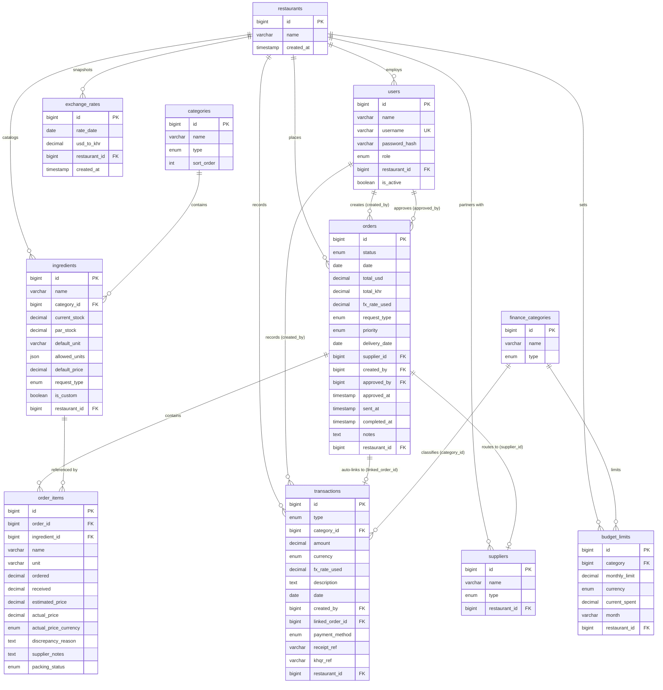
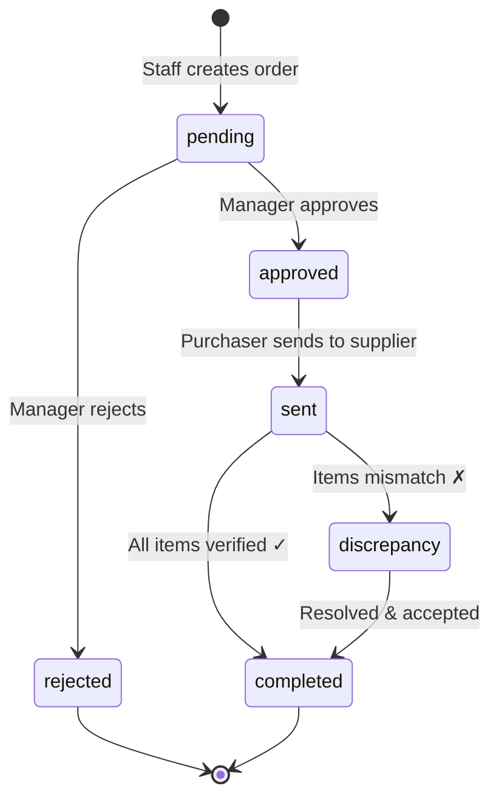

# RestaurantAI — Database Schema

> Comprehensive database schema for the Restaurant Purchase & Supply Management System.
> Derived from full codebase analysis of all TypeScript interfaces, localStorage structures, and data flows.

---

## Table of Contents

1. [Enums & Constants](#1-enums--constants)
2. [Tables](#2-tables)
3. [Entity Relationship Diagram](#3-entity-relationship-diagram)
4. [Order Lifecycle State Machine](#4-order-lifecycle-state-machine)
5. [Indexes & Constraints](#5-indexes--constraints)
6. [Seed Data Catalogs](#6-seed-data-catalogs)

---

## 1. Enums & Constants

### `user_role`

```sql
ENUM('manager', 'staff', 'service', 'chef', 'receiver', 'admin', 'purchaser')
```

| Value | Description (EN) | Description (KH) |
|-------|-------------------|-------------------|
| `manager` | Restaurant Manager — full approval & finance access | អ្នកគ្រប់គ្រងភោជនីយដ្ឋាន |
| `staff` | Kitchen Staff — can create grocery requisitions | បុគ្គលិកផ្ទះបាយ |
| `service` | Service & FOH — can create supply/cash requests | បុគ្គលិកសេវាកម្ម |
| `chef` | Head Chef — can create & prioritize orders | ចុងភៅ |
| `receiver` | Delivery Receiver — can perform check-in | អ្នកទទួលទំនិញ |
| `admin` | System Admin — unrestricted access | អ្នកគ្រប់គ្រងប្រព័ន្ធ |
| `purchaser` | Morning Market Purchaser — fulfills approved orders | អ្នកទិញទំនិញទីផ្សារ |

### `order_status`

```sql
ENUM('pending', 'approved', 'sent', 'discrepancy', 'completed', 'rejected')
```

| Value | Color Token | Label (EN) | Label (KH) |
|-------|-------------|------------|------------|
| `pending` | Orange | Pending Review | រង់ចាំពិនិត្យ |
| `approved` | Blue | Approved | យល់ព្រម |
| `sent` | Sky | Sent to Supplier | ផ្ញើទៅផ្សារ |
| `discrepancy` | Red | Discrepancy | មានខ្វះខូច |
| `completed` | Emerald | Completed | បានទទួលរួច |
| `rejected` | Slate | Rejected | បដិសេធ |

### `request_type`

```sql
ENUM('glossary', 'stuff', 'mixed')
```

| Value | Description |
|-------|-------------|
| `glossary` | Market ingredients (meat, seafood, vegetables, sauces, rice, beverages) |
| `stuff` | Equipment, supplies, petty cash & tip advances |
| `mixed` | Contains both glossary and stuff items |

### `currency`

```sql
ENUM('USD', 'KHR')
```

> Exchange rate constant: **1 USD = 4,000 KHR** (Base exchange rate config)

### `packing_status`

```sql
ENUM('pending', 'packed', 'flagged')
```

### `transaction_type`

```sql
ENUM('income', 'outcome')
```

### `payment_method`

```sql
ENUM('cash', 'aba_pay', 'wing', 'bank_transfer', 'credit', 'khqr')
```

| Value | Display (EN / KH) |
|-------|---------------------|
| `cash` | Cash / សាច់ប្រាក់ |
| `aba_pay` | ABA Pay / ធនាគារ ABA |
| `wing` | Wing / វីង |
| `bank_transfer` | Bank Transfer / ផ្ទេរប្រាក់ |
| `credit` | Credit / ជំពាក់ |
| `khqr` | KHQR / ទូទាត់តាម KHQR |

### `priority`

```sql
ENUM('normal', 'urgent')
```

### `requester_target`

```sql
ENUM('manager', 'purchaser', 'accounting')
```

---

## 2. Tables

### 2.1 `restaurants`

> Multi-tenant restaurant entity.

| Column | Type | Nullable | Default | Description |
|--------|------|----------|---------|-------------|
| `id` | `BIGINT` PK | ✗ | `AUTO_INCREMENT` | Unique restaurant ID |
| `name` | `VARCHAR(255)` | ✗ | | Restaurant name |
| `created_at` | `TIMESTAMP` | ✗ | `NOW()` | Record creation time |
| `updated_at` | `TIMESTAMP` | ✗ | `NOW()` | Last update time |

---

### 2.2 `users`

> System users with role-based access.

| Column | Type | Nullable | Default | Description |
|--------|------|----------|---------|-------------|
| `id` | `BIGINT` PK | ✗ | `AUTO_INCREMENT` | Unique user ID |
| `name` | `VARCHAR(255)` | ✗ | | Full display name |
| `username` | `VARCHAR(100)` UQ | ✗ | | Login username |
| `password_hash` | `VARCHAR(255)` | ✗ | | Bcrypt hash |
| `role` | `user_role` | ✗ | `'staff'` | Access role |
| `restaurant_id` | `BIGINT` FK | ✗ | | → `restaurants.id` |
| `is_active` | `BOOLEAN` | ✗ | `TRUE` | Soft-active flag |
| `created_at` | `TIMESTAMP` | ✗ | `NOW()` | |
| `updated_at` | `TIMESTAMP` | ✗ | `NOW()` | |

---

### 2.3 `categories`

> Ingredient/supply categories.

| Column | Type | Nullable | Default | Description |
|--------|------|----------|---------|-------------|
| `id` | `BIGINT` PK | ✗ | `AUTO_INCREMENT` | Category ID |
| `name` | `VARCHAR(255)` | ✗ | | Category name |
| `type` | `request_type` | ✗ | `'glossary'` | `glossary` or `stuff` |
| `sort_order` | `INT` | ✗ | `0` | Display sort position |

---

### 2.4 `suppliers`

> Vendor/supplier directory.

| Column | Type | Nullable | Default | Description |
|--------|------|----------|---------|-------------|
| `id` | `BIGINT` PK | ✗ | `AUTO_INCREMENT` | Supplier ID |
| `name` | `VARCHAR(255)` | ✗ | | Supplier name |
| `type` | `request_type` | ✗ | `'glossary'` | Market or stuff supplier |
| `restaurant_id` | `BIGINT` FK | ✗ | | → `restaurants.id` |
| `is_active` | `BOOLEAN` | ✗ | `TRUE` | |
| `created_at` | `TIMESTAMP` | ✗ | `NOW()` | |

---

### 2.5 `ingredients`

> Product catalog (grocery ingredients + equipment + cash items).

| Column | Type | Nullable | Default | Description |
|--------|------|----------|---------|-------------|
| `id` | `BIGINT` PK | ✗ | `AUTO_INCREMENT` | Product ID |
| `name` | `VARCHAR(255)` | ✗ | | Product name |
| `category_id` | `BIGINT` FK | ✗ | | → `categories.id` |
| `current_stock` | `DECIMAL(12,2)` | ✗ | `0` | Current inventory level |
| `par_stock` | `DECIMAL(12,2)` | ✗ | `0` | Target stock level |
| `default_unit` | `VARCHAR(20)` | ✗ | `'kg'` | Primary unit of measure |
| `allowed_units` | `JSON` | ✗ | `'[]'` | Array of allowed unit strings |
| `default_price` | `DECIMAL(12,2)` | ✗ | `0.00` | Default USD price per unit |
| `low_stock_threshold` | `DECIMAL(12,2)` | ☐ | `NULL` | Alert threshold |
| `request_type` | `request_type` | ✗ | `'glossary'` | `glossary` or `stuff` |
| `is_custom` | `BOOLEAN` | ✗ | `FALSE` | User-created custom item |
| `restaurant_id` | `BIGINT` FK | ✗ | | → `restaurants.id` |
| `created_at` | `TIMESTAMP` | ✗ | `NOW()` | |
| `updated_at` | `TIMESTAMP` | ✗ | `NOW()` | |

---

### 2.6 `orders`

> Purchase/requisition orders. Total cost tracking uses two separate fields (`total_usd` and `total_khr`) to allow multi-currency baskets without blending.

| Column | Type | Nullable | Default | Description |
|--------|------|----------|---------|-------------|
| `id` | `BIGINT` PK | ✗ | `AUTO_INCREMENT` | Order ID |
| `status` | `order_status` | ✗ | `'pending'` | Current lifecycle status |
| `date` | `DATE` | ✗ | `CURDATE()` | Order date |
| `total_usd` | `DECIMAL(12,2)` | ✗ | `0.00` | USD subtotal |
| `total_khr` | `DECIMAL(12,0)` | ✗ | `0` | KHR subtotal |
| `fx_rate_used` | `DECIMAL(10,2)` | ☐ | `NULL` | Exchange rate applied to this order |
| `request_type` | `request_type` | ✗ | `'glossary'` | Order classification |
| `priority` | `priority` | ✗ | `'normal'` | Urgency level |
| `delivery_date` | `DATE` | ☐ | `NULL` | Target delivery date |
| `requester_role` | `user_role` | ☐ | `NULL` | Role of requester |
| `requested_from` | `requester_target` | ☐ | `NULL` | Approval target |
| `supplier_id` | `BIGINT` FK | ☐ | `NULL` | → `suppliers.id` (assigned market supplier) |
| `created_by` | `BIGINT` FK | ✗ | | → `users.id` |
| `approved_by` | `BIGINT` FK | ☐ | `NULL` | → `users.id` (manager who approved) |
| `approved_at` | `TIMESTAMP` | ☐ | `NULL` | Turnaround timestamp for approval |
| `sent_at` | `TIMESTAMP` | ☐ | `NULL` | Turnaround timestamp for dispatcher |
| `completed_at` | `TIMESTAMP` | ☐ | `NULL` | Turnaround timestamp for receiver check-in |
| `notes` | `TEXT` | ☐ | `NULL` | Free-text notes |
| `restaurant_id` | `BIGINT` FK | ✗ | | → `restaurants.id` |
| `created_at` | `TIMESTAMP` | ✗ | `NOW()` | |
| `updated_at` | `TIMESTAMP` | ✗ | `NOW()` | |

---

### 2.7 `order_items`

> Line items within an order.

| Column | Type | Nullable | Default | Description |
|--------|------|----------|---------|-------------|
| `id` | `BIGINT` PK | ✗ | `AUTO_INCREMENT` | Line item ID |
| `order_id` | `BIGINT` FK | ✗ | | → `orders.id` |
| `ingredient_id` | `BIGINT` FK | ☐ | `NULL` | → `ingredients.id` (NULL for custom) |
| `name` | `VARCHAR(255)` | ✗ | | Item name (denormalized) |
| `category` | `VARCHAR(100)` | ☐ | `NULL` | Category name (denormalized) |
| `unit` | `VARCHAR(50)` | ✗ | | Unit of measure |
| `ordered` | `DECIMAL(12,2)` | ✗ | | Quantity ordered |
| `received` | `DECIMAL(12,2)` | ☐ | `NULL` | Quantity actually received |
| `estimated_price` | `DECIMAL(12,2)` | ☐ | `NULL` | Estimated price per unit (USD) |
| `actual_price` | `DECIMAL(12,2)` | ☐ | `NULL` | Actual price per unit at delivery |
| `actual_price_currency` | `currency` | ☐ | `NULL` | Currency of actual price |
| `discrepancy_reason` | `TEXT` | ☐ | `NULL` | Reason for quantity/price mismatch |
| `supplier_notes` | `TEXT` | ☐ | `NULL` | Instructions for supplier |
| `packing_status` | `packing_status` | ✗ | `'pending'` | Packing verification state |
| `sort_order` | `INT` | ✗ | `0` | Display position within order |

---

### 2.8 `transactions`

> Financial income/outcome records.

| Column | Type | Nullable | Default | Description |
|--------|------|----------|---------|-------------|
| `id` | `BIGINT` PK | ✗ | `AUTO_INCREMENT` | Transaction ID |
| `type` | `transaction_type` | ✗ | | `income` or `outcome` |
| `category_id` | `BIGINT` FK | ✗ | | → `finance_categories.id` |
| `amount` | `DECIMAL(14,2)` | ✗ | | Amount in native currency |
| `currency` | `currency` | ✗ | `'USD'` | Transaction currency |
| `fx_rate_used` | `DECIMAL(10,2)` | ☐ | `NULL` | Exchange rate applied to transaction |
| `description` | `TEXT` | ✗ | | Description text |
| `date` | `DATE` | ✗ | | Transaction date |
| `created_by` | `BIGINT` FK | ✗ | | → `users.id` |
| `linked_order_id` | `BIGINT` FK | ☐ | `NULL` | → `orders.id` (auto-linked) |
| `payment_method` | `payment_method` | ✗ | `'cash'` | How payment was made |
| `receipt_ref` | `VARCHAR(100)` | ☐ | `NULL` | Receipt/invoice reference |
| `khqr_ref` | `VARCHAR(100)` | ☐ | `NULL` | KHQR transaction reference code |
| `restaurant_id` | `BIGINT` FK | ✗ | | → `restaurants.id` |
| `created_at` | `TIMESTAMP` | ✗ | `NOW()` | |
| `updated_at` | `TIMESTAMP` | ✗ | `NOW()` | |

---

### 2.9 `finance_categories`

> Category definitions for income/outcome.

| Column | Type | Nullable | Default | Description |
|--------|------|----------|---------|-------------|
| `id` | `BIGINT` PK | ✗ | `AUTO_INCREMENT` | Category ID |
| `name` | `VARCHAR(255)` | ✗ | | Category name |
| `type` | `transaction_type` | ✗ | | `income` or `outcome` |
| `sort_order` | `INT` | ✗ | `0` | Display position |

---

### 2.10 `budget_limits`

> Monthly spending limits per category.

| Column | Type | Nullable | Default | Description |
|--------|------|----------|---------|-------------|
| `id` | `BIGINT` PK | ✗ | `AUTO_INCREMENT` | Limit ID |
| `category` | `BIGINT` FK | ✗ | | → `finance_categories.id` |
| `monthly_limit` | `DECIMAL(14,2)` | ✗ | | Maximum monthly spend |
| `currency` | `currency` | ✗ | `'USD'` | Limit currency |
| `current_spent` | `DECIMAL(14,2)` | ✗ | `0.00` | Running total |
| `month` | `VARCHAR(7)` | ✗ | | Period key (e.g. `'2026-07'`) |
| `restaurant_id` | `BIGINT` FK | ✗ | | → `restaurants.id` |

---

### 2.11 `exchange_rates`

> Daily/applied currency exchange rates to avoid historical calculation drift.

| Column | Type | Nullable | Default | Description |
|--------|------|----------|---------|-------------|
| `id` | `BIGINT` PK | ✗ | `AUTO_INCREMENT` | Exchange Rate ID |
| `rate_date` | `DATE` | ✗ | | Date of snapshot |
| `usd_to_khr` | `DECIMAL(10,2)` | ✗ | | Conversion multiplier |
| `restaurant_id` | `BIGINT` FK | ✗ | | → `restaurants.id` |
| `created_at` | `TIMESTAMP` | ✗ | `NOW()` | Capture timestamp |

---

## 3. Entity Relationship Diagram



---

## 4. Order Lifecycle State Machine



---

## 5. Indexes & Constraints

### Primary Keys
- Every table has a `PK` on `id`

### Foreign Keys

```sql
ALTER TABLE users           ADD CONSTRAINT fk_users_restaurant      FOREIGN KEY (restaurant_id)    REFERENCES restaurants(id);
ALTER TABLE ingredients     ADD CONSTRAINT fk_ingredients_category   FOREIGN KEY (category_id)      REFERENCES categories(id);
ALTER TABLE ingredients     ADD CONSTRAINT fk_ingredients_restaurant FOREIGN KEY (restaurant_id)    REFERENCES restaurants(id);
ALTER TABLE suppliers       ADD CONSTRAINT fk_suppliers_restaurant   FOREIGN KEY (restaurant_id)    REFERENCES restaurants(id);
ALTER TABLE orders          ADD CONSTRAINT fk_orders_created_by      FOREIGN KEY (created_by)       REFERENCES users(id);
ALTER TABLE orders          ADD CONSTRAINT fk_orders_approved_by     FOREIGN KEY (approved_by)      REFERENCES users(id);
ALTER TABLE orders          ADD CONSTRAINT fk_orders_supplier        FOREIGN KEY (supplier_id)      REFERENCES suppliers(id);
ALTER TABLE orders          ADD CONSTRAINT fk_orders_restaurant      FOREIGN KEY (restaurant_id)    REFERENCES restaurants(id);
ALTER TABLE order_items     ADD CONSTRAINT fk_items_order            FOREIGN KEY (order_id)         REFERENCES orders(id) ON DELETE CASCADE;
ALTER TABLE order_items     ADD CONSTRAINT fk_items_ingredient       FOREIGN KEY (ingredient_id)    REFERENCES ingredients(id);
ALTER TABLE transactions    ADD CONSTRAINT fk_tx_created_by          FOREIGN KEY (created_by)       REFERENCES users(id);
ALTER TABLE transactions    ADD CONSTRAINT fk_tx_category            FOREIGN KEY (category_id)      REFERENCES finance_categories(id);
ALTER TABLE transactions    ADD CONSTRAINT fk_tx_linked_order        FOREIGN KEY (linked_order_id)  REFERENCES orders(id);
ALTER TABLE transactions    ADD CONSTRAINT fk_tx_restaurant          FOREIGN KEY (restaurant_id)    REFERENCES restaurants(id);
ALTER TABLE budget_limits   ADD CONSTRAINT fk_budget_category        FOREIGN KEY (category)         REFERENCES finance_categories(id);
ALTER TABLE budget_limits   ADD CONSTRAINT fk_budget_restaurant      FOREIGN KEY (restaurant_id)    REFERENCES restaurants(id);
ALTER TABLE exchange_rates  ADD CONSTRAINT fk_fx_restaurant          FOREIGN KEY (restaurant_id)    REFERENCES restaurants(id);
```

### Unique Constraints

```sql
ALTER TABLE users ADD CONSTRAINT uq_users_username UNIQUE (username);
ALTER TABLE transactions ADD CONSTRAINT uq_tx_linked_order UNIQUE (linked_order_id);
ALTER TABLE budget_limits ADD CONSTRAINT uq_budget_cat_month UNIQUE (category, month, restaurant_id);
ALTER TABLE exchange_rates ADD CONSTRAINT uq_fx_date_restaurant UNIQUE (rate_date, restaurant_id);
```

### Check Constraints

```sql
-- Enforces that cash advance line items (tip advance, petty cash) always have ordered quantity = 1.
ALTER TABLE order_items
  ADD CONSTRAINT chk_cash_advance_qty
  CHECK (
    ingredient_id IS NULL
    OR ingredient_id NOT IN (
      SELECT id FROM ingredients WHERE category_id = (
        SELECT id FROM categories WHERE name = 'Petty Cash & Tip Advance' LIMIT 1
      )
    )
    OR ordered = 1
  );
```

### Performance Indexes

```sql
CREATE INDEX idx_orders_dashboard ON orders (restaurant_id, status, date);
CREATE INDEX idx_transactions_reporting ON transactions (restaurant_id, date);
CREATE INDEX idx_ingredients_lookup ON ingredients (restaurant_id, category_id);
```

---

## 6. Seed Data Catalogs

### 6.1 Market Categories (`categories` WHERE `type = 'glossary'`)

| id | name |
|----|------|
| `Meat & Poultry` | Meat & Poultry |
| `Seafood & Fish` | Seafood & Fish |
| `Vegetables & Herbs` | Vegetables & Herbs |
| `Sauces & Pantry` | Sauces & Pantry |
| `Rice & Noodles` | Rice & Noodles |
| `Beverages & Ice` | Beverages & Ice |

### 6.2 Stuff Categories (`categories` WHERE `type = 'stuff'`)

| id | name |
|----|------|
| `Glassware & Tableware` | Glassware & Tableware |
| `Petty Cash & Tip Advance` | Petty Cash & Tip Advance |
| `Kitchen Equipment & Tools` | Kitchen Equipment & Tools |
| `Cleaning & Sanitation` | Cleaning & Sanitation |
